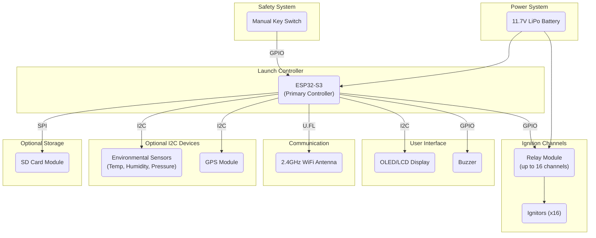

# Hardware Schematic

```mermaid
graph TD
    subgraph "Launch Controller"
        ESP32_S3("ESP32-S3<br/>(Primary Controller)")
    end

    subgraph "Power System"
        LIPO("11.7V LiPo Battery") --> ESP32_S3
    end

    subgraph "Ignition Channels"
        RELAYS("Relay Module<br/>(up to 16 channels)")
        IGNITORS("Ignitors (x16)")
        LIPO --> RELAYS --> IGNITORS
    end
    
    subgraph "User Interface"
        DISPLAY("OLED/LCD Display")
        BUZZER("Buzzer")
    end

    subgraph "Safety System"
        KEY_SWITCH("Manual Key Switch")
    end

    subgraph "Communication"
        WIFI_ANTENNA("2.4GHz WiFi Antenna")
    end
    
    subgraph "Optional I2C Devices"
        direction LR
        SENSORS("Environmental Sensors<br/>(Temp, Humidity, Pressure)")
        GPS("GPS Module")
    end

    subgraph "Optional Storage"
        SD_CARD("SD Card Module")
    end

    ESP32_S3 -- "GPIO" --> RELAYS
    ESP32_S3 -- "I2C" --> DISPLAY
    ESP32_S3 -- "GPIO" --> BUZZER
    KEY_SWITCH -- "GPIO" --> ESP32_S3
    ESP32_S3 -- "U.FL" --> WIFI_ANTENNA
    ESP32_S3 -- "I2C" --> SENSORS
    ESP32_S3 -- "I2C" --> GPS
    ESP32_S3 -- "SPI" --> SD_CARD
``` 